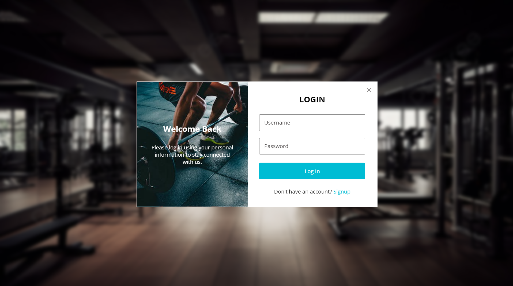
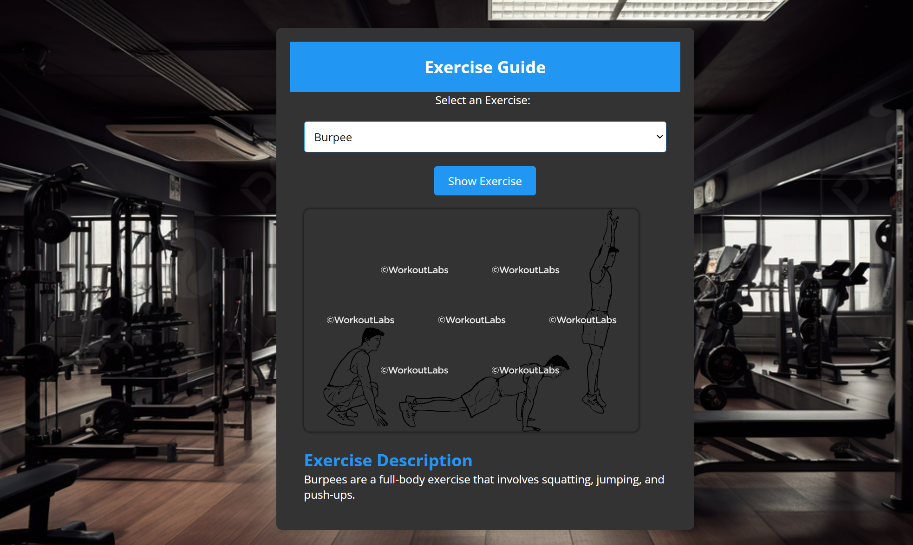

# Fitness Project

## Overview

This project is a comprehensive fitness website that offers various features to help users achieve their fitness goals. The website includes functionalities such as BMI calculation, calorie needs estimation, an exercise guide, and user profile management. It is built using PHP for backend processing, MySQL for database management, and JavaScript for interactive frontend components. The project was completed on 2024/02/01, I handled the Back-End, and my friend Yazeed handheld the Front-End.

## Demo

Check out the demo of the project on YouTube: [Demo Video]()

## Features

1. **User Authentication**
   - Secure login and signup system.
   - Session management to ensure user authentication.
2. **BMI Calculator**
   - Calculates Body Mass Index based on user's height and weight.
   - Displays the BMI category and provides guidelines for weight management.
3. **Calorie Needs Calculator**

   - Estimates daily caloric needs based on user's age, gender, height, weight, and activity level.
   - Provides guidelines for gaining, maintaining, or losing weight.

4. **Exercise Guide**

   - Offers descriptions and images for various exercises.
   - Helps users understand how to perform exercises correctly.

5. **User Profile Management**
   - Allows users to view and update their profile information.
   - Displays calculated BMI and caloric needs.

## Project Structure

```plaintext
root
├── calculate_bmi.php
├── calculate_calories.php
├── db.php
├── index.php
├── login.php
├── logout.php
├── profile.php
├── singup.php
├── login-singup.js
├── script.js
├── z.js
├── z.css
├── login.css
├── singup.css
├── images/
│   └── (page images and other assets)
├── img/
│   └── (exercise images and other assets)
└── fitness_db.sql
```

## Installation

### Clone the Repository

## Setup the Database

1. **Import fitness_db.sql into your MySQL database.**
2. **Update db.php with your database credentials.**

## Configure the Server

1. Ensure you have PHP and MySQL installed.
2. Place the project files in your server's root directory.

## Start the Server

- Use a local server like XAMPP or MAMP, or deploy to a web server.

## Usage

### Sign Up

- Navigate to `signup.php` to create a new account.

### Log In

- Navigate to `login.php` to log in with your credentials.

### Calculate BMI

- Go to the BMI section on the home page, enter your height and weight, and calculate your BMI.

### Calculate Caloric Needs

- Go to the Caloric Needs section, fill in your details, and calculate your daily caloric needs.

### Exercise Guide

- Browse through the Exercise Guide section to learn about different exercises.

### Profile

- View and manage your profile information on `profile.php`.

## Screenshots

#### Login Page :

#### Profile Page :

#### Workout Section :


## Credits

- **Frontend Development:** Yazed Alaosaimi
- **Backend Development:** Mohammed Aleshawi